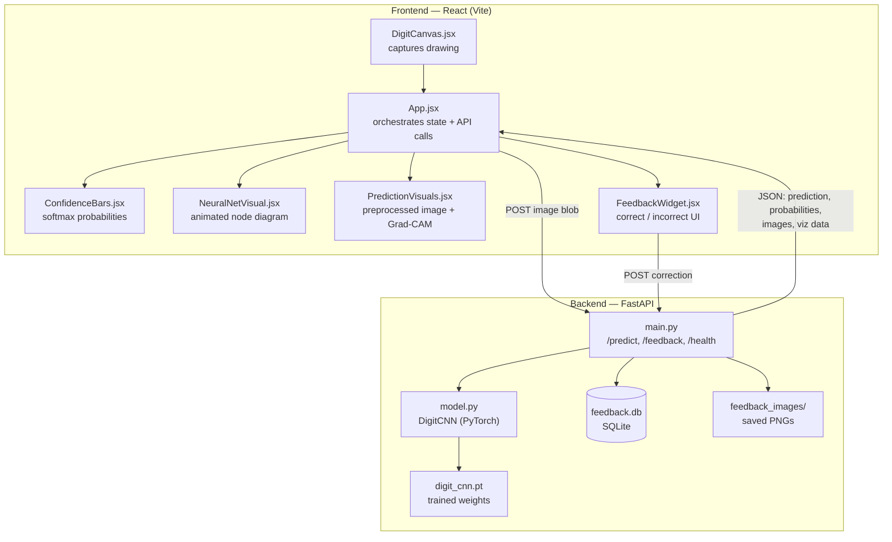
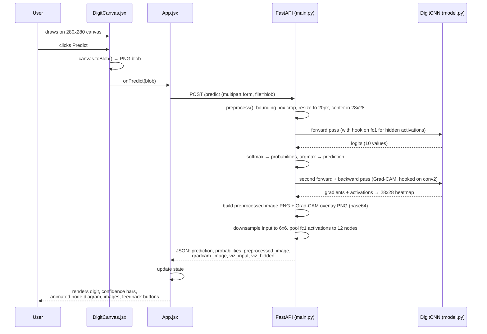

# AI Digit Recognizer — React + FastAPI + CNN

A hand-drawn digit recognizer. You draw a digit (0–9) on a canvas in the
browser; a CNN trained on MNIST predicts what it is, shows a live confidence
breakdown, an animated node diagram of the network, a Grad-CAM heatmap of
what the model focused on, and a feedback loop to collect corrections for
future retraining.

This README documents **everything**: what each part does, how it works,
why it was built that way, and the trade-offs involved — written so it's
useful as a reference months from now, or if someone else reads the repo.

---

## Table of contents

1. [Problem this solves](#1-problem-this-solves)
2. [System architecture](#2-system-architecture)
3. [End-to-end request flow](#3-end-to-end-request-flow)
4. [The model — architecture and why](#4-the-model--architecture-and-why)
5. [Training — what happens and why](#5-training--what-happens-and-why)
6. [Preprocessing — the most important hidden step](#6-preprocessing--the-most-important-hidden-step)
7. [Backend — FastAPI, endpoint by endpoint](#7-backend--fastapi-endpoint-by-endpoint)
8. [Frontend — component by component](#8-frontend--component-by-component)
9. [Grad-CAM — the math and the code](#9-grad-cam--the-math-and-the-code)
10. [Node visualization — what's real vs illustrative](#10-node-visualization--whats-real-vs-illustrative)
11. [Feedback loop and retraining path](#11-feedback-loop-and-retraining-path)
12. [Why these tech choices](#12-why-these-tech-choices)
13. [File-by-file reference](#13-file-by-file-reference)
14. [Setup — step by step](#14-setup--step-by-step)
15. [Known limitations](#15-known-limitations)
16. [Ideas for extending this](#16-ideas-for-extending-this)
17. [Troubleshooting](#17-troubleshooting)

---

## 1. Problem this solves

Classifying a hand-drawn digit sounds trivial ("just train a CNN on MNIST"),
but the interesting engineering problem is everything **around** the model:

- MNIST images are clean, pre-cropped, and centered. A digit drawn on a
  random-sized HTML canvas is none of those things — it can be off-center,
  a different scale, drawn with a shaky mouse, etc. Feeding raw canvas
  pixels into an MNIST-trained model without correcting for this is the
  single biggest reason naive digit recognizers perform far worse in a
  browser than their reported test accuracy suggests.
- A prediction with no visibility into *why* the model chose that digit is
  a black box. This project treats explainability (Grad-CAM, the node
  diagram, the "what the model actually saw" preview) as a first-class
  feature, not an afterthought.
- A static model never improves. The feedback loop turns this from a demo
  into something that can genuinely get better over time on your own
  handwriting.

---

## 2. System architecture



**Why a client/server split instead of running the model entirely in the
browser (e.g. TensorFlow.js)?** Keeping inference in Python/PyTorch means
Grad-CAM, hidden-layer activation extraction, and future retraining all stay
in one language and one codebase — no need to re-implement gradient hooks
in JavaScript. The trade-off is you need a running backend process; that's
a fair trade for a project meant to be developed and explained, not just
demoed.

---

## 3. End-to-end request flow

This is exactly what happens, in order, when you draw a digit and click
**Predict**:



Two forward passes happen per prediction: one plain pass for the actual
classification, and one more (inside `compute_gradcam`) that also runs a
backward pass to get gradients. This is intentionally kept simple rather
than trying to reuse one pass for both — for a single 28x28 image the extra
pass costs a few milliseconds on CPU, which is irrelevant here, and keeping
the two concerns separate in code is easier to read and debug.

---

## 4. The model — architecture and why

`backend/model.py` defines `DigitCNN`:

```
Input: 1×28×28 grayscale image
  ↓ Conv2d(1→32, kernel=3, padding=1) + ReLU
  ↓ MaxPool2d(2)                          →  32×14×14
  ↓ Conv2d(32→64, kernel=3, padding=1) + ReLU
  ↓ MaxPool2d(2)                          →  64×7×7
  ↓ Flatten                               →  3136
  ↓ Linear(3136→128) + ReLU
  ↓ Dropout(0.3)
  ↓ Linear(128→10)                        →  10 logits
```

**Why two conv blocks instead of one or five?** MNIST digits are simple
enough (28×28, single channel, no texture/color complexity) that two
conv-pool blocks are enough to reach ~99% test accuracy. More layers would
add training time and overfitting risk without meaningfully improving
accuracy on this dataset — this isn't ImageNet.

**Why 32 then 64 filters (not e.g. 16 then 32, or 64 then 128)?** This is
the standard "double the channels as spatial size halves" pattern common in
CNN design — it roughly balances the amount of computation done at each
resolution level. 32/64 is comfortably enough capacity for MNIST without
being wasteful.

**Why 3×3 kernels with padding=1?** 3×3 is the standard choice in modern CNN
design (small receptive field, stacked layers build up larger effective
receptive fields cheaply). `padding=1` keeps the spatial size unchanged
after each conv (28→28, 14→14) so only the `MaxPool2d` layers reduce
resolution — this makes the spatial math easy to track and reason about.

**Why MaxPool instead of, say, strided convolutions?** MaxPool is simpler,
has no learnable parameters, and works well for a small, well-understood
dataset like MNIST. Strided convs are more common in larger, more modern
architectures — unnecessary complexity here.

**Why Dropout(0.3) only before the final layer?** The fully-connected layer
(3136→128) has the most parameters in the network and is where overfitting
is most likely to show up first on a relatively small/simple dataset.
Dropout there is a lightweight regularizer. `0.3` (drop 30% of activations
during training) is a common default — high enough to help, low enough not
to starve the network of signal.

**Why return raw logits instead of applying softmax inside the model?**
`nn.CrossEntropyLoss` (used in training) expects raw logits and applies
`log_softmax` internally for numerical stability — applying softmax twice
would be both redundant and mathematically wrong. Softmax is applied once,
explicitly, at inference time in `main.py` where we actually need
probabilities.

---

## 5. Training — what happens and why

`backend/train.py`:

1. **Loads MNIST** via `torchvision.datasets.MNIST` — auto-downloads
   60,000 training images and 10,000 test images, no manual dataset hunting
   required.

2. **Applies data augmentation to the training set only:**
   ```python
   transforms.RandomAffine(degrees=10, translate=(0.1, 0.1), scale=(0.9, 1.1))
   ```
   - `degrees=10`: rotates each training image up to ±10°. Enough to cover
     natural handwriting tilt, not so much that a rotated 6 starts looking
     like a 9 (a real risk if this were, say, ±40°).
   - `translate=(0.1, 0.1)`: shifts the image up to 10% of its size in x/y —
     simulates a digit not being perfectly centered when initially drawn
     (before our preprocessing step re-centers it anyway — this is belt and
     suspenders).
   - `scale=(0.9, 1.1)`: randomly scales the digit ±10% — simulates people
     drawing digits at slightly different sizes.

   **Why augment at all, if we re-center everything before inference
   anyway?** Because augmentation doesn't just handle canvas quirks — it
   also acts as a general regularizer, forcing the model to learn features
   that are robust to minor variation rather than memorizing exact pixel
   positions from the clean MNIST training set.

3. **Test set stays clean** (no augmentation) — this gives an honest,
   comparable accuracy number across epochs, uncontaminated by the
   randomness of augmentation.

4. **Normalization:** `Normalize((0.1307,), (0.3081,))` — these are the
   precomputed mean and standard deviation of the *entire* MNIST training
   set. This is a standard, well-known constant in the PyTorch/MNIST
   ecosystem, not something invented for this project — using it makes
   pixel values roughly zero-centered and unit-variance, which helps
   gradient descent converge faster and more stably.

5. **Optimizer: Adam, lr=1e-3.** Adam adapts the learning rate per
   parameter automatically, which makes it a safe, low-maintenance default
   for a project like this — no manual learning-rate scheduling needed to
   hit ~99% accuracy on MNIST.

6. **10 epochs, batch size 64.** MNIST is small and simple enough that
   accuracy plateaus quickly — 10 epochs reliably reaches ~98–99% test
   accuracy without wasting time on further training that yields
   diminishing returns.

7. **Saves `digit_cnn.pth`** via `torch.save(model.state_dict(), ...)` —
   only the learned weights are saved (not the full model object), which is
   the recommended PyTorch practice: it's more portable across code
   changes and avoids pickling the entire class definition.

   *(Note: `.pth` and `.pt` are functionally identical — both are just
   file extensions PyTorch doesn't distinguish between. `.pth` was used
   here mostly by convention; renaming to `.pt` and updating the two
   references in `train.py` / `main.py` works with zero other changes.)*

---

## 6. Preprocessing — the most important hidden step

This is the piece that makes or breaks real-world accuracy, implemented in
`preprocess()` in `main.py`.

**The problem:** MNIST images are already tightly cropped and centered by
NIST's original data collection process. A digit drawn on a 280×280 HTML
canvas is not — it could be drawn small in a corner, huge and off-center,
anywhere. Feeding that directly into a model trained exclusively on
centered 28×28 images causes it to see something quite different from
what it learned on, even if the digit itself is recognizable to a human.

**The fix, step by step:**

1. **Convert to grayscale** and find every pixel brighter than a small
   threshold (`> 20`, to ignore near-black background noise) — this locates
   where the actual drawing is.
2. **Compute the bounding box** of those pixels (min/max x and y).
3. **Crop to that bounding box** — removes all the empty canvas space.
4. **Resize so the longest side is 20px**, preserving aspect ratio. Why
   20px and not 28px? MNIST digits, once centered in their 28×28 frame,
   typically only occupy about a 20×20 core area — leaving a small margin
   around the digit matches what the model saw during training.
5. **Paste the resized digit into a blank 28×28 canvas, centered.** This
   mimics MNIST's own construction (NIST's original process centered
   digits by center of mass; this implementation uses bounding-box
   centering as a simpler, close approximation — accurate enough in
   practice, cheaper to compute).
6. **Normalize** using the same MNIST mean/std constants used in training.

Skipping any one of these steps is the most common reason a "99% accurate"
model performs noticeably worse the moment it's hooked up to a real drawing
canvas.

---

## 7. Backend — FastAPI, endpoint by endpoint

All in `backend/main.py`.

### `GET /health`
Trivial liveness check — returns `{"status": "ok"}`. Useful for confirming
the server started successfully and the model loaded without errors before
debugging anything else.

### `POST /predict`
Accepts a multipart file upload (the canvas PNG). Returns:

```json
{
  "prediction": 7,
  "probabilities": [0.001, 0.002, ..., 0.94, ...],
  "preprocessed_image": "base64 PNG — what the model actually saw",
  "gradcam_image": "base64 PNG — heatmap overlay",
  "viz_input": [0.0, 0.12, ...],
  "viz_hidden": [0.0, 0.87, ...]
}
```

Internally:
- Runs `preprocess()` (Section 6).
- Registers a temporary forward hook on `model.fc1` to capture hidden-layer
  activations *during the same forward pass* used for the prediction — no
  extra inference cost for this.
- Computes softmax probabilities and the predicted class.
- Calls `compute_gradcam()` (Section 9), which runs its own forward +
  backward pass.
- Encodes both images as base64 PNGs via `array_to_base64_png()`, upscaled
  with **nearest-neighbor** interpolation (not bilinear) specifically so the
  28×28 source stays crisp and pixelated rather than blurry — this is a
  deliberate choice to visually communicate "this is a low-resolution
  grid," not smooth it away.
- Downsamples the input to a 6×6 grid and pools the 128 hidden activations
  to 12 groups for the node visualization (Section 10).

### `POST /feedback`
Accepts a file plus `predicted_digit` and `true_digit` form fields. Saves
the image to `feedback_images/<uuid>.png` and logs a row in
`feedback.db` (SQLite) with both labels and a timestamp. This is the raw
data for future retraining (Section 11).

### `GET /feedback/count`
Returns how many corrections have been collected — a quick way to check
whether you've gathered enough data to be worth retraining on.

**Why SQLite instead of a "real" database?** Zero setup — it's a single
file, no server process to run, perfect for a personal project. Since
you're already comfortable with MSSQL from your other projects, swapping
this out later (same schema: id, image_path, predicted_digit, true_digit,
created_at) is a small, well-scoped upgrade if this ever needs to run for
multiple concurrent users.

**Why is CORS wide open (`allow_origins=["*"]`)?** This is fine for local
development where frontend and backend run on your own machine. If this
were ever deployed publicly, this should be tightened to the actual
frontend origin — noted here so it isn't forgotten.

---

## 8. Frontend — component by component

All in `frontend/src/`.

### `App.jsx` — the orchestrator
Holds all shared state (prediction, probabilities, images, viz data,
loading/error flags) and is the only component that talks to the backend.
Passes data down to child components as props. This "lift state up" pattern
is standard React practice for a small app like this — no need for Redux
or Context at this scale.

### `DigitCanvas.jsx` — capturing the drawing
A raw HTML5 `<canvas>` (280×280px — 10x the model's 28×28 input, big enough
to comfortably draw on) with mouse *and* touch event handlers (so it works
on phones/tablets too). Key details:
- `lineWidth: 18` — a thick stroke was chosen because MNIST digits, once
  normalized into a 28×28 frame, tend to have proportionally thick strokes;
  a thin 2–3px line would under-represent the "ink" density the model
  expects.
- `lineCap: "round"` and `lineJoin: "round"` — prevents visibly jagged
  corners between mouse-move segments, producing smoother strokes.
- On **Predict**, calls `canvas.toBlob()` to get a PNG blob, handed up to
  `App.jsx` via the `onPredict` callback — the canvas component itself
  knows nothing about the backend; it only produces an image.

### `ConfidenceBars.jsx` — showing uncertainty, not just the answer
Renders one horizontal bar per digit (0–9), width driven directly by that
digit's softmax probability, with the highest one highlighted in green.
Showing *all 10* probabilities (not just the top prediction) matters
because it reveals model uncertainty — e.g. a messy "4" might show 60%
confidence for 4 and 35% for 9, which a single "Prediction: 4" label would
hide entirely.

### `PredictionVisuals.jsx` — the two debug images
Displays `preprocessed_image` and `gradcam_image` side by side, both
rendered with `imageRendering: "pixelated"` in CSS so the browser doesn't
smooth/blur the upscaled 28×28-origin images. These exist specifically so
you (or anyone reading this repo) can visually verify: (a) preprocessing
is centering digits correctly, and (b) the model is looking at the digit's
actual strokes, not some irrelevant background artifact.

### `NeuralNetVisual.jsx` — the animated node diagram
See Section 10 for the full breakdown of what's real vs illustrative here.

### `FeedbackWidget.jsx` — the correction loop UI
After a prediction: "Was this correct?" → Yes/No. If No, shows ten buttons
(0–9) to pick the actual digit. Either path POSTs to `/feedback` with the
original image blob (kept in `App.jsx` state as `lastBlob` specifically so
it can be resent here without re-encoding).

---

## 9. Grad-CAM — the math and the code

Grad-CAM (Gradient-weighted Class Activation Mapping) answers: *"which
pixels most influenced this specific prediction?"* Implemented in
`compute_gradcam()` in `main.py`.

**The core idea, step by step:**

1. Pick the **last convolutional layer** (`conv2` here) — its feature maps
   still have spatial structure (a 14×14 grid, one per filter) but have
   also gone through enough of the network to encode meaningful,
   class-relevant patterns rather than raw edges. This is the standard
   Grad-CAM layer choice.
2. **Forward hook** on `conv2` captures its output activations,
   `A` — shape `(64, 14, 14)` (64 filters, each a 14×14 map).
3. Run the forward pass, take the logit for the **predicted class**,
   call `.backward()` on it.
4. **Backward hook** on `conv2` captures the gradients of that class score
   with respect to `A` — shape `(64, 14, 14)`, telling us how much each
   pixel in each feature map would need to change to increase the
   predicted class's score.
5. **Global-average-pool the gradients** over the spatial dimensions for
   each of the 64 filters → 64 scalar weights, `α_k`. Each `α_k`
   represents "how important is filter k's feature map to this
   prediction, overall."
6. **Weighted sum:** `cam = Σ_k α_k · A_k` — combine all 64 feature maps,
   weighted by how important each one was.
7. **ReLU** the result — Grad-CAM only cares about features that had a
   *positive* influence on the predicted class, not negative ones.
8. **Normalize to [0, 1]** and **upsample from 14×14 to 28×28** (bilinear)
   to match the input image resolution.
9. **Overlay** the heatmap on the grayscale preprocessed image in red,
   blended with an alpha of 0.55 (`make_gradcam_overlay()`) — bright red =
   high influence, unchanged grayscale = low influence.

This entire computation costs almost nothing extra (one small backward
pass on a 28×28 image) but gives real, mathematically grounded insight
into the model's decision — not a decorative visual.

---

## 10. Node visualization — what's real vs illustrative

`NeuralNetVisual.jsx`, fed by `viz_input` and `viz_hidden` from the
backend, draws a simplified "input → hidden → output" diagram. This
section is important to read closely, because **not everything in this
diagram is a literal representation of the network** — and that's a
deliberate, documented trade-off, not an inaccuracy hiding in the code.

**What's real:**
- **Input nodes (36 of them, 6×6 grid):** the actual preprocessed 28×28
  image, downsampled to 6×6 via bilinear interpolation. Brightness =
  real pixel intensity.
- **Hidden nodes (12 of them):** the model's actual 128 `fc1` activations
  (captured via forward hook, same technique as Grad-CAM), pooled into 12
  groups by averaging consecutive chunks and normalized to [0, 1] for
  display. Brightness = real activation strength.
- **Output nodes (10 of them):** the real softmax probabilities — no
  approximation needed since there are only 10.

**What's illustrative, and why:**
- **Edges (connections between nodes):** their brightness is computed as
  `source_activation × target_activation`, *not* the model's actual
  learned weight for that specific connection. The real network has
  3,136×128 + 128×10 ≈ 402,000 individual weighted connections between
  the flattened conv output and the dense layers — rendering all of them,
  or even a faithful sample, would be either meaningless visual noise or
  would require reducing to so few edges that it stops looking like the
  actual architecture. The chosen approach — brightness by co-activation —
  gives an intuitive "signal flowing through active nodes" visual that's
  honest about being a simplification (and says so directly in the UI
  caption, and here).
- **Grouping 128 hidden units into 12 display nodes:** picked purely for
  visual readability — 128 individual circles would be an unreadable wall
  of dots at this scale. 12 was chosen as a small enough number to look
  like a clean diagram while still being large enough to show meaningful
  variation between different digits' activation patterns.
- **Animation timing** (staggered `animationDelay` per node, increasing
  left to right): purely aesthetic, meant to convey "the signal is moving
  through the network," which is conceptually true (computation *does*
  flow input → hidden → output) even though the actual forward pass
  computes everything in a single, near-instantaneous matrix operation
  rather than node-by-node.

This is the kind of distinction worth mentioning if you present this
project — it shows you understand the difference between a technically
accurate visualization and a pedagogically useful one, and made a
deliberate choice rather than an accidental one.

---

## 11. Feedback loop and retraining path

**What exists now:** every time you click "No" and pick the correct digit
(or confirm "Yes"), the image and both labels (`predicted_digit`,
`true_digit`) are saved — the image as a PNG file in
`backend/feedback_images/`, the metadata as a row in `backend/feedback.db`
(SQLite).

**What retraining on this data would look like** (not yet automated,
described here as the designed next step):

1. Query `feedback.db` for all rows, load each corresponding image from
   `feedback_images/`.
2. Run each image through the *same* `preprocess()` function used at
   inference time, so the retrained model sees data in exactly the same
   format it will see in production.
3. Combine these examples with the original MNIST training set (or
   oversample the feedback examples slightly, since they represent
   real, harder cases the model actually got wrong or that a real user
   drew).
4. Re-run training (same architecture, same loop as `train.py`) on the
   combined dataset.
5. Replace `digit_cnn.pt` with the newly trained weights.

This wasn't automated in this version deliberately — it's a meaningful
next feature to build yourself, and doing so would also be a natural
place to add a scheduled job or a manual `retrain.py` script.

---

## 12. Why these tech choices

| Choice | Why |
|---|---|
| **PyTorch** over TensorFlow/Keras | More explicit, "close to the math" style — makes writing custom things like the Grad-CAM hooks straightforward, since you directly control forward/backward hooks rather than working through a higher-level abstraction. |
| **FastAPI** over Flask | Async support out of the box, automatic interactive API docs at `/docs` (useful for testing endpoints without writing a frontend first), and built-in request validation via typed parameters (`file: UploadFile`, `predicted_digit: int`). |
| **React (Vite)** over vanilla JS | Component-based structure keeps canvas logic, confidence display, node viz, and feedback UI cleanly separated and independently reusable/testable, at the cost of a build step. Vite specifically was chosen over Create React App for its much faster dev server startup and hot-reload speed. |
| **SQLite** over MSSQL/Postgres | Zero setup for a personal project — a single file, no server process. Documented as a clear, small upgrade path to MSSQL later given your existing familiarity with it. |
| **Canvas + PNG upload** over sending raw pixel arrays | Simpler on both ends — the browser already has a built-in, well-tested way to encode canvas content as PNG (`toBlob`), and the backend already needs PIL for image processing regardless. |
| **Server-side preprocessing** over client-side | Keeps the "what does the model actually see" logic in one place (Python), so it's guaranteed to be identical between training-time expectations and inference-time reality — no risk of a JavaScript reimplementation subtly drifting from the Python version. |

---

## 13. File-by-file reference

```
digit-recognizer/
├── backend/
│   ├── model.py             DigitCNN architecture definition
│   ├── train.py              Trains on MNIST + augmentation, saves digit_cnn.pth
│   ├── main.py                FastAPI app: preprocessing, inference, Grad-CAM,
│   │                          node-viz data extraction, feedback storage
│   ├── requirements.txt      Backend Python dependencies
│   ├── digit_cnn.pt           (generated by train.py — not committed to git)
│   ├── feedback.db            (generated at runtime — not committed to git)
│   └── feedback_images/       (generated at runtime — not committed to git)
├── frontend/
│   ├── src/
│   │   ├── App.jsx                    Orchestrates state + all API calls
│   │   ├── main.jsx                    React entry point
│   │   ├── index.css                   Global styles
│   │   └── components/
│   │       ├── DigitCanvas.jsx         Drawing surface, produces a PNG blob
│   │       ├── ConfidenceBars.jsx      Per-digit probability bars
│   │       ├── PredictionVisuals.jsx   Preprocessed image + Grad-CAM overlay
│   │       ├── NeuralNetVisual.jsx     Animated input→hidden→output node diagram
│   │       └── FeedbackWidget.jsx      Correct/incorrect feedback UI
│   ├── index.html
│   ├── package.json
│   └── vite.config.js
├── .gitignore
└── README.md                 (this file)
```

---

## 14. Setup — step by step

### Prerequisites
- Python 3.9+
- Node.js 18+

### Backend

```bash
cd digit-recognizer/backend
python -m venv venv
source venv/bin/activate        # Windows: venv\Scripts\activate
pip install -r requirements.txt
python train.py                 # trains the model, creates digit_cnn.pth (a few minutes)
uvicorn main:app --reload --port 8000
```

Verify it's running: visit `http://localhost:8000/health` →
`{"status": "ok"}`. Interactive API docs: `http://localhost:8000/docs`.

### Frontend

In a **new terminal**:

```bash
cd digit-recognizer/frontend
npm install
npm run dev
```

Open the printed URL (typically `http://localhost:5173`).

### Using it

1. Draw a digit on the canvas.
2. Click **Predict**.
3. See: the predicted digit, confidence bars for all 10 classes, the
   animated node diagram, the preprocessed image + Grad-CAM heatmap, and
   feedback buttons.
4. Confirm or correct the prediction — this saves the example for future
   retraining.

---

## 15. Known limitations

- **Single digit only** — no support for recognizing a full handwritten
  number (multiple digits) in one drawing.
- **Distribution mismatch risk** — the model only knows white-on-black
  digits matching MNIST's convention; drawing with unusual stroke styles
  far outside MNIST's distribution (e.g. very thin lines, disconnected
  segments) can reduce accuracy.
- **CORS is wide open** (`allow_origins=["*"]`) — fine for local
  development, should be restricted before any public deployment.
- **SQLite** isn't built for concurrent multi-user write access — fine for
  a single local user, not for a multi-user deployment without upgrading
  to a proper database server.
- **No authentication** on the `/feedback` endpoint — anyone with network
  access to the backend could submit arbitrary "corrections."
- **Retraining is manual** — the feedback data is collected but not yet
  automatically folded back into the model (see Section 11).

---

## 16. Ideas for extending this

- Automate the retraining pipeline described in Section 11
- Multi-digit recognition — segment a whole handwritten number with OpenCV
  contour detection, classify each digit separately
- Swap SQLite for MSSQL/Postgres for the feedback store
- Package the frontend as a PWA for offline use
- Add authentication before any public deployment
- Deploy the model in-browser via TensorFlow.js as an alternative,
  backend-free mode

---

## 17. Troubleshooting

| Problem | Fix |
|---|---|
| `RuntimeError: 'digit_cnn.pt' not found` | Run `python train.py` before starting `uvicorn` |
| Frontend shows "Could not reach backend" | Make sure `uvicorn` is running on port 8000 |
| CORS errors in browser console | Confirm `CORSMiddleware` is present in `main.py` (it is, by default) |
| Predictions look wrong even after training | Check canvas stroke width isn't too thin/thick — 18px works well for a 280x280 canvas |
| `pip install` fails on torch | Visit https://pytorch.org/get-started/locally/ for a platform-specific install command |
| Node diagram looks static / doesn't animate | Make sure you're on a version of the browser that supports CSS custom properties in inline styles (all modern browsers do) |
